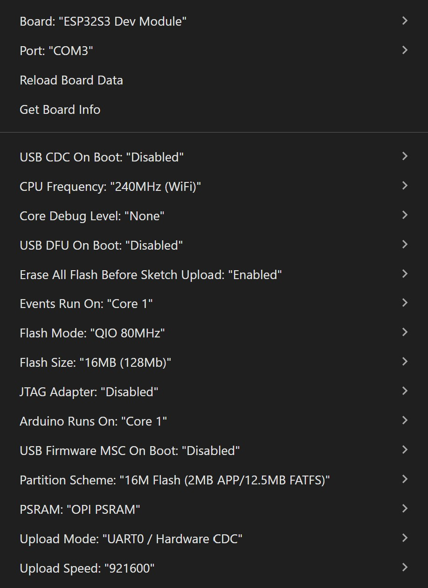

# ESP32-S3 Internet Radio

> [!WARNING]
> This project has been tested **exclusively** on the **ESP32-S3-Touch-LCD-1.54** board (which includes the ES8311 Audio Codec). Compatibility with other ESP32 boards is not guaranteed without manually modifying the pinouts in the code.

A highly power-optimized, feature-rich Internet Radio project built for the ESP32-S3.

## 🌟 Original Core Features
*   **High-Quality Streaming:** Decodes MP3/AAC streams via the ESP32-audioI2S library and outputs to the ES8311 I2S DAC.
*   **Live Metadata (ICY):** Extracts the "Now Playing" track information from the stream and displays it as a smooth scrolling marquee at the bottom of the screen.
*   **Live Bitrate:** Parses HTTP headers to show the actual streaming bitrate in real-time.
*   **Hardware Controls:** Uses physical buttons for Sleep/Wake (GPIO 0), Volume (GPIO 4), and Next Station (GPIO 5).

## 🚀 New Enhancements (Added in this Fork)

### 🔋 Power & Battery Optimizations
This firmware has been heavily modified to maximize battery life:
*   **Auto-Dimming:** The LCD backlight drops to a very low brightness after 15 seconds of no interaction.
*   **Auto-Sleep (Idle):** Automatically turns off the amplifier and enters ESP32 Deep Sleep after 45 minutes of no physical interaction.
*   **Auto-Sleep (Stopped):** If the music stream drops or stops playing for 5 minutes, the device safely goes to Deep Sleep to prevent battery drain.
*   **UI Refresh Throttling:** The dashboard redraw loop runs only once every second (1 FPS), and the visualizer is disabled/flattened when stopped, allowing the CPU and SPI bus to rest while the song marquee continues to scroll at a smooth 30ms rate.

### 📺 User Interface Enhancements
*   **Retro NTP Clock Screensaver:** After 1 minute of inactivity, the UI displays a large digital clock synced via NTP. It features a retro 8-bit blocky font (`Font 0`) for the station name and sleep countdown timer, inline AM/PM display, and manual pixel-centered formatting.
*   **Smart Text Wrapping & Ellipsis:** Extremely long station names on the screensaver automatically wrap to a second line and truncate with a trailing `...` if they exceed the width limit, adjusting the layout dynamically.
*   **Dynamic WiFi Bars:** A visual 4-bar WiFi signal indicator that dynamically reacts to the ESP32's RSSI.
*   **Smart Battery Warning:** The battery voltage and icon stay green during normal use, but instantly turn red to warn you if the voltage drops below 3.4V (approx. 15%).

### ⚙️ System & Controls
*   **Dynamic Station List:** Automatically fetches your favorite radio stations from a remote text file (`stations.txt`) at boot, so you never have to re-flash the firmware just to add a new station!
*   **Self-Healing Station List:** Automatically detects if a station's stream is offline or broken. If it fails to play for 15 seconds, it instantly removes the dead station from memory and auto-skips to the next one!
*   **WiFi Manager (Captive Portal):** No more hardcoded WiFi credentials! If the radio cannot find a known network, it creates its own "ESP32_Radio" hotspot. Connect to it with your phone to securely input your WiFi password.
*   **Long-Press Station Navigation:** Upgraded the existing "Next Station" button (GPIO 5). You can now hold it for 0.5 seconds to instantly jump to the **Previous Station**.

## 🐛 Bug Fixes & Refinements
*   **Non-Blocking Station Navigation:** Decoupled the UI navigation from the heavy audio connection logic. You can now rapidly click through stations without freezing the ESP32! The audio connection process only begins once you stop clicking (after an 800ms delay).
*   **Graceful Metadata Fallback:** Fixed an issue where the scrolling text would permanently get stuck on "Loading..." if a radio stream did not support track metadata. It now gracefully defaults to `"Listening to [Station Name]"` unless real metadata arrives.

## 🚀 Setup
1. Edit the `STATIONS_URL` variable in `winRadio.ino` to point to your own `stations.txt` file.
2. The format of the remote text file should be: `Station Name | http://stream-url.com`
3. Configure your Arduino IDE board settings exactly as shown in the provided image below:
   

   
4. Flash to your ESP32-S3!

---

## 🙏 Credits & Acknowledgements
This project is a heavily optimized and feature-expanded fork of the original fantastic work by VolosR. 
* Original Base Project: [VolosR/WaveshareRadioStream](https://github.com/VolosR/WaveshareRadioStream)
* Additional Contributions: [marknelson/WaveshareRadioStream](https://github.com/marknelson/WaveshareRadioStream)
